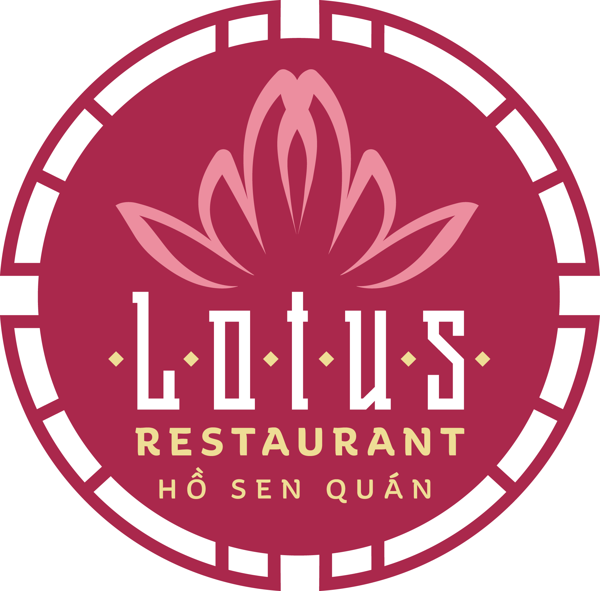

<!-- PROJECT LOGO -->

  <!-- <a href="https://github.com/othneildrew/Best-README-Template"> -->
    
  <!-- </a> -->

  <h3 align="center">Ho Sen Quan website</h3>

  

<!-- ABOUT THE PROJECT -->
## About The Project

This project is a website redesign for an Vietnamese restaurant located in Prague, Czech Republic. 
The aim is to create a website that is mobile friendly with a modern UX.
The goal is to update the current design at: hosenquan.cz

### Built With

* [Gatsby.js](https://www.gatsbyjs.com/)
* [React.js](https://reactjs.org/)
* [styled-components](https://styled-components.com/)
